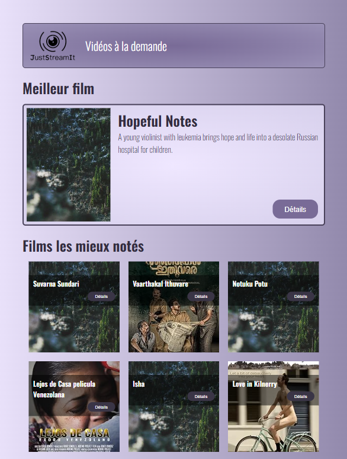

# P6 : Application web pour le classement de films

Projet réalisé dans le cadre du développement d'une application web pour l'association JustStreamIt.

Il s'agit d'une application permettant la visualisation en temps réel du classement de films.

---

## Fonctionnalités

- Récupération de données de film à partir de l'API OC-Movies-API : https://github.com/OpenClassrooms-Student-Center/OCMovies-API-EN-FR 
  - Films filtrés par score IMDB et/ou genre
  - Données des films récupérées via l'id : 
    - titre ; résumé ; URL de l'image ; année de parution ; genres ; classification ; durée du film ; pays d'origine ; score IMDB ; recettes au box-office ; réalisateurs ; acteurs


- Affichage des films : 
  - Meilleur film (toutes catégories confondues)
  - Meilleurs films (toutes catégories confondues)
  - Meilleurs films d'une catégorie (Sci-Fi ; Adventure)
  - Meilleurs films d'une catégorie choisie parmi la liste des catégories (menu déroulant)
  - Utilisation d'image générique via https://picsum.photos dans le cas d'un URL d'image invalide


- Affichage détails films : 
  - Gestion de boutons "détails" pour accéder aux détails d'un film
  - Fenêtre modale contenant tous les détails du film


- Responsive : 
  - Les dimensions des éléments et le nombre de films affichés varient en fonction de la taille d'écran utilisée
  - Gestion d'un bouton voir plus/moins pour afficher/masquer les films lors de l'utilisation d'un petit écran (mobile et tablette)


---

## Architecture

Le projet suit une architecture modulaire avec séparation des responsabilités :
- HTML : Structure sémantique de la page
- CSS : Mise en forme et responsive design (approche mobile-first)
- JavaScript : Gestion des appels API (fetch), manipulation dynamique du DOM, logique métier et des événements utilisateur
- API : Récupération dynamique des données via requêtes HTTP

Le projet respecte les standards W3C.

---

## Structure du projet

```
P6_Front-end_JustStreamIt/

    README.md                           # Documentation
    .gitignore                          # Liste des dossiers et fichiers à ignorer pour le repository

    
    html/                               # Dossier contenant les fichiers HTML
        index.html                      # Fichier HTML principal 
    
    image/                              # Dossier contenant les images
        logo.png                        # Logo de l'association JustStreamIt
        screenshot.png                  # Aperçu du site
    
    scripts/                            # Dossier contenant les fichiers JavaScript
        config.js                       # Contient des options de configuration
        dataAPI.js                      # Contient les fonctions permettant de récupérer les données de l'API
        feedXML.js                      # Contient les fonctions permettant d'alimenter le fichier XML
        init.js                         # Contient les fonctions permettant d'écouter divers événements du fichier XML
        main.js                         # Point d'entrée de l'application
    
    styles/                             # Dossier contenant les fichiers CSS
        style.css                       # Feuille de style CSS principal
```

---

## Technologies utilisées

- API OC-Movies-API : https://github.com/OpenClassrooms-Student-Center/OCMovies-API-EN-FR
- HTML5 
- CSS3 
- JavaScript (ES2021)
- W3C Validator (validation HTML/CSS)

---

## Installation 

### Prérequis :

- Installation et lancement local de l'API OC-Movies-API via repo : https://github.com/OpenClassrooms-Student-Center/OCMovies-API-EN-FR

### Cloner le repository : 

```bash
git clone https://github.com/duncan-g-hub/P6_Front-end_JustStreamIt.git
cd P6_Front-end_JustStreamIt
```

---

## Exécution de l'application

L’API doit être lancée localement pour que l’application fonctionne correctement.
Ouvrir le fichier `index.html` dans un navigateur moderne (Chrome, Firefox, Edge).

---

## Compatibilité

Le site a été testé sur les dernières versions stables des navigateurs les plus utilisés :
- Google Chrome (v145)
- Mozilla Firefox (v147)
- Microsoft Edge (v144)

Compatible avec les navigateurs modernes supportant ES2021.
Le site respecte les standards HTML5 et CSS3 validés par le validateur W3C, ce qui garantit une compatibilité avec les navigateurs modernes.

---

## Aperçu 



---

## Contact

Pour toute question :  
Duncan GAURAT - duncan.dev@outlook.fr

            
